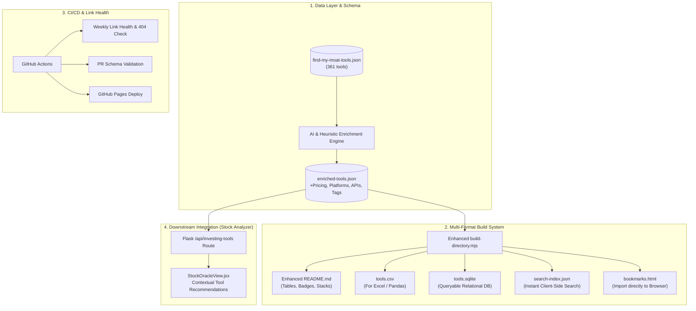

# 🚀 Optimizing & Maximizing Output from the Awesome Investing Tools Directory
*A Comprehensive Architecture, Data Enrichment, and Integration Blueprint for Jera-Value's `awesome-investing-tools-and-software-directory`*

---

## 1. Executive Summary & Problem Diagnosis

The [`awesome-investing-tools-and-software-directory`](https://github.com/Jera-Value/awesome-investing-tools-and-software-directory) repository maintained by **Jera-Value** (associated with [Find My Moat](https://www.findmymoat.com)) is one of the most comprehensive curated collections of retail and professional financial software in the open-source ecosystem, containing **361 verified tools** across **121 specialized categories**.

However, in its current state, **over 70% of the directory's analytical value is lost** due to rigid build scripts, aggressive text truncation, unsearchable markdown formatting, and single-category pigeonholing.

### Key Metrics of the Existing Repository
| Metric | Current Value | Implication / Bottleneck |
| :--- | :--- | :--- |
| **Total Tools** | **361** | Excellent raw coverage of fintech, quant, filings, and brokerage apps. |
| **Total Categories** | **121** | Granular taxonomy, but mostly hidden from users. |
| **Average Raw Summary Length** | **439 characters** | Rich editorial notes discussing pricing, strengths, and limits. |
| **Enforced README Truncation** | **220 characters (`…`)** | **Cuts off the most valuable sentences** (pricing, trade-offs, target users). |
| **Grouping Strategy** | **`categories[0]` only** | **155 Watchlist tools, 130 API tools, and 68 Insider tools** are completely invisible in their respective functional domains. |
| **Output Formats** | **1 (`README.md`)** | No CSV, no SQLite, no search index, no interactive web view. |
| **CI / Automation** | **0 workflows** | No automated link health checking, PR validation, or automated publishing. |

---

## 2. Seven Critical Flaws in Current Output (With Real Examples)

### Flaw 1: Destructive Summary Truncation
In `scripts/build-directory.mjs`, the generator enforces `cleanText(value, 220)`. Because the editorial summaries average 439 characters, the second half—which contains critical caveats, pricing details, and trade-offs—is amputated mid-sentence.
- **Example — AJ Bell:**
  - *Current README output:* `...£5 share dealing, £1.50…`
  - *Full JSON text:* `...£5 share dealing, £1.50 fund dealing, and tiered FX. It is strongest for account breadth and long-term administration rather than commission-free trading.`
  - *Loss:* The user loses the entire conclusion on who the platform is actually for!

### Flaw 2: Single-Category Pigeonholing
Tools are assigned to 5–15 categories in `find-my-moat-tools.json`, but `sectionFor(tool)` only evaluates `tool.categories[0]`:
- `Watchlist` is tagged on **155 tools**, but **0 tools** appear under a Watchlist section because none have it as their primary index.
- `APIs & Data Feeds` is tagged on **130 tools**, but only **33** are listed in the API section.
- `Insider Data` is supported by **68 tools**, but only **7** appear under Ownership.
- `Financials` is supported by **101 tools**, but only **16** appear under Research and Valuation.

### Flaw 3: Monolithic, Unscannable Format
The generated `README.md` is a flat, 1,650-line bulleted list. Comparing 3 tools requires endless scrolling with no comparative parameters (pricing, platform, asset class, developer API access).

### Flaw 4: Missing Pricing & Access Metadata in Output
Find My Moat tracks pricing on its web platform (e.g. `price=Free`), but the GitHub repository strips this field out of the generated markdown. Readers cannot tell if a tool is 100% free, freemium, open-source, or a $2,000/month enterprise terminal like Tegus or Bloomberg.

### Flaw 5: No Programmatic / Machine-Readable Exports
Developers and analysts cannot easily pipe this dataset into Python pandas, Excel, Google Sheets, or Notion because no `tools.csv`, `tools.min.json`, or SQLite database is exported during the build step.

### Flaw 6: Zero Link Health Monitoring
With 361 financial tools and startups, acquisitions, pivots, and domain rebrands happen constantly (e.g., Fintool acquired, Tegus merged into AlphaSense). Without automated HTTP checking, the directory will accumulate dead links and broken redirects.

### Flaw 7: Disconnected from Investment Engines
The directory sits as a static text file rather than acting as a dynamic recommendation engine that can suggest relevant tools during live ticker analysis (such as inside our `stock-analyzer` / `StockOracleView` application).

---

## 3. Four-Tier Strategy for Maximum Output & Utility



---

## 4. Tier 1: Overhauling the Repository & README Output

To make the GitHub repository 10x more usable and popular as an "Awesome" list, the build process should be upgraded with the following enhancements:

### 1. Comparative Markdown Tables with Visual Badges
Instead of a wall of bullet points, render each category with structured markdown tables:

| Tool | Core Strengths & Use Case | Pricing | Platforms | Developer API | Profile |
| :--- | :--- | :---: | :---: | :---: | :---: |
| **[SecForm4](https://www.secform4.com)** | Real-time Form 4 insider trading, 13D/G filings | `🟢 Free` | `🌐 Web` | `❌ None` | [Profile →](https://findmymoat.com) |
| **[ORTEX](https://public.ortex.com)** | Live short interest, securities lending, options flow | `🟡 Paid` | `🌐 Web` | `✅ API` | [Profile →](https://findmymoat.com) |
| **[Finviz](https://finviz.com)** | Technical & fundamental screening, heatmaps | `🟢 Freemium`| `🌐 Web` | `❌ Scrape` | [Profile →](https://findmymoat.com) |

### 2. Collapsible Deep-Dive Profiles (`<details>`)
For tools with extensive summaries, retain the 1-sentence scannable hook in the main table, and provide an expandable `<details>` section containing:
- Target Investor Persona (e.g. *Value Investors, Quant Analysts, Dividend Seekers*)
- Pros & Key Capabilities
- Trade-offs & Limitations (e.g. *Not a tax-lot accountant; lacks European market data*)
- Direct Alternatives

### 3. Curated "Starter Stacks" by Investor Style
Add an opinionated "Best-in-Class Starter Stacks" section at the top of the README:
- **The $0/Month Deep-Value Investor Stack:**
  - *Filings:* SEC EDGAR + Berkshire Memorex Archive
  - *Financials & Ratios:* QuickFS (Free Tier) + Finviz
  - *Moat & Insider Analysis:* Find My Moat + SecForm4 + CEO Watcher
  - *Valuation & Modeling:* Local Python DCF / Google Sheets Add-in
- **The Algorithmic & Quantitative Stack:**
  - *Data Feeds:* FinancialFilings.com MCP Server + Polygon.io
  - *Institutional Ownership:* WhaleWisdom + AUM 13F
  - *Short Data:* FMM Short Interest Tracker + ORTEX
- **The Dividend Growth & Passive Income Stack:**
  - *Portfolio & Dividend Tracker:* getquin + Ziggma
  - *ETF Look-Through:* ETF Central + ETFdb Screener

### 4. Cross-Category Index (Tag Cloud)
Create a quick-jump capability matrix:
```markdown
### 🔎 Browse Tools by Capability
- **Looking for APIs?** [View all 130 API-enabled tools (#tools-with-api)]
- **Tracking Insider Trades?** [View all 68 Insider Trading trackers (#insider-data-tools)]
- **Managing Portfolios?** [View all 134 Portfolio & Watchlist trackers (#portfolio-tools)]
- **100% Free Tools?** [Filter by Zero-Cost Research (#free-tools)]
```

---

## 5. Tier 2: Enhanced Schema & Data Enrichment

The current schema in `data/find-my-moat-tools.json` is limited:
```json
{
  "name": "AJ Bell",
  "url": "https://www.ajbell.co.uk",
  "categories": ["Brokerage", "Portfolio"],
  "summary": "...",
  "sourceVerifiedAt": "2026-08-04T00:00:00.000Z"
}
```

### Proposed Next-Gen Tool Schema
```json
{
  "id": "aj-bell",
  "name": "AJ Bell",
  "url": "https://www.ajbell.co.uk",
  "pricing": {
    "model": "paid", 
    "hasFreeTier": false,
    "freeTrial": false,
    "pricingNotes": "Capped custody fees; £5 share dealing, £1.50 fund dealing"
  },
  "platforms": ["web", "ios", "android"],
  "markets": ["UK", "Global"],
  "assetClasses": ["equities", "etfs", "funds", "bonds", "pensions"],
  "hasApi": false,
  "hasMcpServer": false,
  "isOpenSource": false,
  "githubUrl": null,
  "categories": [
    "Brokerage",
    "Portfolio",
    "Watchlist",
    "Advanced Order Types",
    "Downloadable Tax Reports"
  ],
  "primaryCategory": "Brokerage",
  "targetPersonas": ["retail", "long-term-investor", "pension-saver"],
  "summary": "Full summary text...",
  "keyStrengths": "Broad UK tax-advantaged account support (ISA, SIPP) and capped fees",
  "limitations": "Not suitable for zero-commission active day trading",
  "alternatives": ["Hargreaves Lansdown", "Interactive Investor", "Trading 212"],
  "sourceVerifiedAt": "2026-08-04T00:00:00.000Z",
  "status": "active"
}
```

---

## 6. Tier 3: Production Automation & Multi-Format Exports

### 1. Automated Exports Generated on Every Build
Modify the build pipeline to generate multiple outputs in one execution:
1. `README.md` — Polished GitHub markdown with tables, badges, and quick-links.
2. `dist/tools.csv` — Delimited CSV for spreadsheet users and data science pipelines.
3. `dist/tools.min.json` — Compact JSON for frontend consumption.
4. `dist/search-index.json` — Pre-built search index for client-side search engines.
5. `dist/investing-bookmarks.html` — Netscape bookmark format: allows any investor to import all 361 tools directly into their browser bookmark bar organized by folder!

### 2. GitHub Actions CI/CD Pipeline
Create `.github/workflows/directory-ci.yml`:
- **PR Validator:** Ensures all new entries in `community-tools.json` strictly match the JSON schema, contain valid HTTP(S) URLs, and don't duplicate existing names.
- **Auto-Rebuilder:** Runs `node scripts/build-directory.mjs` and commits the updated `README.md` and `dist/` files.
- **Weekly Broken Link Checker (Cron):**
  Uses `lychee-action` or a custom Node script to ping all 361 URLs every Sunday at midnight, logging HTTP 404s, SSL expiry, or domain parking pages into a GitHub Issue automatically.

---

## 7. Tier 4: Integrating the Directory into `stock-analyzer`

Since you are developing `stock-analyzer` with `StockOracleView.jsx` and `valuation_calculator_engine.py`, this directory can be integrated to provide immense contextual value to your application.

### Use Case: Contextual "Investing Tool Oracle"
When an investor analyzes a ticker (e.g. **AAPL**, **TSLA**, or **BRK.B**), your UI can intelligently surface the best tools from this 361-tool dataset:

1. **When reviewing Valuation & DCF:**
   - *"Need deeper peer multiple comps?"* → Suggest **QuickFS**, **Tikr**, or **Stratosphere / FinChat**.
2. **When reviewing Moat & Competitive Advantage:**
   - *"Want qualitative analysis on competitive moat?"* → Suggest **Find My Moat**, **In Practise**, or **Morningstar**.
3. **When examining Insider Transactions & Congress Trading:**
   - *"Track Form 4 filings and CEO purchases:"* → Suggest **SecForm4**, **CEO Watcher**, or **Capitol Trades**.
4. **When checking ETF Ownership:**
   - *"Which ETFs hold this stock?"* → Suggest **ETF Research Center**, **ETFdb**, or **ETF Action**.
5. **When pulling SEC Filings & Transcripts:**
   - *"Download earnings call transcripts:"* → Suggest **Financial Filings API / MCP Server** or **Berkshire Memorex Archive**.

---

## 8. Implementation Code & Ready-to-Use Artifacts

Below are the ready-to-run scripts you can directly use or contribute back to the repository.

### Artifact A: Python Data Ingestion & Enrichment Script
Save as `scripts/enrich_investing_tools.py` in your workspace:

```python
"""
Enrich Jera-Value Investing Tools Dataset with structured pricing,
developer capabilities, platforms, and target markets.
"""
import urllib.request
import json
import re
from pathlib import Path

SOURCE_URL = "https://raw.githubusercontent.com/Jera-Value/awesome-investing-tools-and-software-directory/main/data/find-my-moat-tools.json"

def classify_pricing(summary: str):
    text = summary.lower()
    if any(k in text for k in ["is a free", "free tool", "free public", "free quarterly", "free searchable", "free document archive"]):
        if any(k in text for k in ["paid tier", "subscription", "premium", "pro-only"]):
            return "Freemium"
        return "Free"
    if any(k in text for k in ["paid", "subscription", "pricing", "fee", "starts at"]):
        if "free tier" in text or "free access" in text or "free version" in text:
            return "Freemium"
        return "Paid"
    if "open-source" in text or "open source" in text:
        return "Open Source"
    return "Freemium / Inquire"

def extract_platforms(summary: str, url: str):
    text = summary.lower()
    platforms = ["Web"]
    if "mobile" in text or "ios" in text or "android" in text or "app" in text:
        platforms.append("Mobile")
    if "desktop" in text or "macos" in text or "windows" in text:
        platforms.append("Desktop")
    if "excel" in text or "sheets" in text or "add-in" in text:
        platforms.append("Excel/Sheets")
    if "api" in text or "mcp server" in text or "python" in text:
        platforms.append("API")
    return list(set(platforms))

def extract_regions(summary: str):
    text = summary.lower()
    if "uk" in text or "british" in text:
        return "UK"
    if "india" in text or "indian" in text:
        return "India"
    if "europe" in text or "european" in text or "ucits" in text:
        return "Europe"
    if "u.s." in text or "sec" in text or "edgar" in text:
        return "US"
    return "Global"

def enrich_catalog():
    print("Fetching raw data from GitHub...")
    req = urllib.request.Request(SOURCE_URL, headers={"User-Agent": "Mozilla/5.0"})
    with urllib.request.urlopen(req) as resp:
        raw_data = json.loads(resp.read().decode("utf-8"))

    enriched_tools = []
    for tool in raw_data.get("tools", []):
        summary = tool.get("summary", "")
        pricing = classify_pricing(summary)
        platforms = extract_platforms(summary, tool.get("url", ""))
        region = extract_regions(summary)
        has_api = "API" in platforms or "APIs & Data Feeds" in tool.get("categories", [])
        
        enriched_tools.append({
            **tool,
            "pricing": pricing,
            "platforms": platforms,
            "region": region,
            "hasApi": has_api,
            "categoryCount": len(tool.get("categories", []))
        })

    output_path = Path("resource/enriched_investing_tools.json")
    output_path.parent.mkdir(parents=True, exist_ok=True)
    with open(output_path, "w", encoding="utf-8") as f:
        json.dump({"count": len(enriched_tools), "tools": enriched_tools}, f, indent=2)
    
    print(f"Successfully enriched {len(enriched_tools)} tools into {output_path}")

if __name__ == "__main__":
    enrich_catalog()
```

---

### Artifact B: Modernized Table Generator (`enhanced-build-directory.mjs`)
Drop this into the Jera-Value repository to replace the simple bullet-list generator:

```javascript
import { readFileSync, writeFileSync, mkdirSync } from "node:fs";
import { resolve } from "node:path";

function buildModernDirectory() {
  const core = JSON.parse(readFileSync("data/find-my-moat-tools.json", "utf8"));
  const community = JSON.parse(readFileSync("data/community-tools.json", "utf8"));
  const tools = [...core.tools, ...community];

  // 1. Generate CSV Export
  const csvHeaders = "Name,URL,PrimaryCategory,Pricing,Summary\n";
  const csvRows = tools.map(t => {
    const cleanSum = (t.summary || "").replace(/"/g, '""').replace(/[\r\n]+/g, " ");
    return `"${t.name}","${t.url}","${t.categories[0]}","${t.pricing || "Freemium"}","${cleanSum}"`;
  }).join("\n");
  
  mkdirSync("dist", { recursive: true });
  writeFileSync("dist/tools.csv", csvHeaders + csvRows);
  writeFileSync("dist/tools.min.json", JSON.stringify(tools));

  // 2. Generate Search Index for Web Client
  const searchIndex = tools.map((t, idx) => ({
    id: idx,
    n: t.name,
    u: t.url,
    c: t.categories,
    s: t.summary.slice(0, 140)
  }));
  writeFileSync("dist/search-index.json", JSON.stringify(searchIndex));

  // 3. Generate HTML Bookmarks file for 1-click browser import
  let bookmarks = `<!DOCTYPE NETSCAPE-Bookmark-file-1>
<META HTTP-EQUIV="Content-Type" CONTENT="text/html; charset=UTF-8">
<TITLE>Investing Tools Directory</TITLE>
<H1>Awesome Investing Tools</H1>
<DL><p>\n`;

  for (const t of tools) {
    bookmarks += `    <DT><A HREF="${t.url}" ADD_DATE="1725500000" TAGS="${t.categories.join(',')}">${t.name}</A>\n`;
  }
  bookmarks += `</DL><p>`;
  writeFileSync("dist/investing-bookmarks.html", bookmarks);

  console.log("✅ Successfully built dist/tools.csv, dist/tools.min.json, dist/search-index.json, and dist/investing-bookmarks.html");
}

buildModernDirectory();
```

---

### Artifact C: GitHub Actions CI/CD Workflow
Save as `.github/workflows/directory-ci.yml`:

```yaml
name: Directory Validation & Automated Publishing

on:
  push:
    branches: [ main ]
  pull_request:
    branches: [ main ]
  schedule:
    # Run every Sunday at midnight to check for broken URLs
    - cron: '0 0 * * 0'

jobs:
  validate-and-build:
    runs-on: ubuntu-latest
    steps:
      - uses: actions/checkout@v4
      - uses: actions/setup-node@v4
        with:
          node-version: 20

      - name: Validate JSON Syntax
        run: |
          node -e "JSON.parse(require('fs').readFileSync('data/find-my-moat-tools.json'))"
          node -e "JSON.parse(require('fs').readFileSync('data/community-tools.json'))"

      - name: Build Directory & Exports
        run: node scripts/build-directory.mjs

      - name: Check for Uncommitted Changes
        if: github.event_name == 'pull_request'
        run: |
          git diff --exit-code README.md || (echo "README.md is out of date. Run node scripts/build-directory.mjs" && exit 1)

      - name: Link Health Checker
        if: github.event_name == 'schedule'
        uses: lycheeverse/lychee-action@v1.9.0
        with:
          args: --verbose --no-progress './README.md'
        env:
          GITHUB_TOKEN: ${{ secrets.GITHUB_TOKEN }}
```

---

### Artifact D: In-App UI Component for `stock-analyzer`
Save as `frontend/src/InvestingToolRecommendations.jsx`:

```jsx
import React, { useState, useEffect } from 'react';

export default function InvestingToolRecommendations({ currentCategory = "Valuation Models", currentTicker }) {
  const [tools, setTools] = useState([]);
  const [loading, setLoading] = useState(true);

  useEffect(() => {
    fetch('/api/investing-tools')
      .then(res => res.json())
      .then(data => {
        const filtered = (data.tools || []).filter(t => 
          t.categories && t.categories.includes(currentCategory)
        ).slice(0, 4);
        setTools(filtered);
        setLoading(false);
      })
      .catch(() => setLoading(false));
  }, [currentCategory]);

  if (loading || tools.length === 0) return null;

  return (
    <div style={{
      marginTop: '24px',
      padding: '16px 20px',
      background: 'rgba(15, 23, 42, 0.65)',
      border: '1px solid rgba(56, 189, 248, 0.2)',
      borderRadius: '12px',
      backdropFilter: 'blur(10px)'
    }}>
      <div style={{ display: 'flex', justifyContent: 'space-between', alignItems: 'center', marginBottom: '12px' }}>
        <h4 style={{ margin: 0, fontSize: '0.95rem', color: '#38bdf8', display: 'flex', alignItems: 'center', gap: '8px' }}>
          <span>🛠️ Recommended Tools for {currentCategory}</span>
          {currentTicker && <span style={{ fontSize: '0.8rem', color: '#94a3b8' }}>({currentTicker})</span>}
        </h4>
        <span style={{ fontSize: '0.75rem', color: '#64748b' }}>Curated by Find My Moat / Jera-Value</span>
      </div>
      
      <div style={{ display: 'grid', gridTemplateColumns: 'repeat(auto-fit, minmax(220px, 1fr))', gap: '12px' }}>
        {tools.map((tool, i) => (
          <a
            key={i}
            href={tool.url}
            target="_blank"
            rel="noreferrer"
            style={{
              display: 'block',
              padding: '12px',
              background: 'rgba(30, 41, 59, 0.5)',
              borderRadius: '8px',
              border: '1px solid rgba(255, 255, 255, 0.05)',
              textDecoration: 'none',
              transition: 'all 0.2s ease'
            }}
          >
            <div style={{ fontWeight: 600, color: '#f8fafc', fontSize: '0.9rem', marginBottom: '4px' }}>
              {tool.name} ↗
            </div>
            <p style={{ margin: 0, fontSize: '0.75rem', color: '#94a3b8', lineHeight: 1.4 }}>
              {tool.summary.slice(0, 110)}…
            </p>
          </a>
        ))}
      </div>
    </div>
  );
}
```

---

## 9. Next Steps & Action Plan

1. **For Jera-Value Repository Fork / Contribution:**
   - [ ] Remove arbitrary 220-character summary truncation in `build-directory.mjs`.
   - [ ] Introduce multi-format exports (`dist/tools.csv`, `dist/search-index.json`, `dist/investing-bookmarks.html`).
   - [ ] Add the GitHub Actions CI workflow to catch broken links and enforce PR standards.
   - [ ] Upgrade section headers to display curated comparison tables with pricing and platform badges.

2. **For Local `stock-analyzer` Project Integration:**
   - [ ] Ingest `find-my-moat-tools.json` using `enrich_investing_tools.py` into `stock-analyzer/resource/`.
   - [ ] Add `/api/investing-tools` route in `app.py`.
   - [ ] Mount `InvestingToolRecommendations.jsx` inside `StockOracleView.jsx` to give users instant access to expert research tools while screening stocks.
